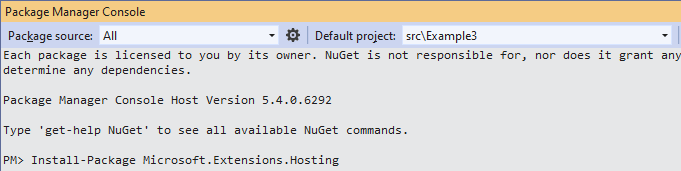

# .NET Core 3.1 - Configurations

In this solution we explore how we can configure settings. The examples make use of .NET Core 3.1.
In all examples we make use of the configuration rpvoider from `Microsoft.Extensions.Configuration`.

## Example 1
In the `application.settings.json` file, place the following section:

```json
"Example1": {
    "SiteConfiguration": {
      "BaseUrl": "https://www.example1.com",
      "Key": "ExAmPlE1KeY"
    }
  }
```

So the file looks like:

```json
{
  "Logging": {
    "LogLevel": {
      "Default": "Information",
      "Microsoft": "Warning",
      "Microsoft.Hosting.Lifetime": "Information"
    }
  },
  "Example1": {
    "SiteConfiguration": {
      "BaseUrl": "https://www.example1.com",
      "Key": "ExAmPlE1KeY"
    }
  },
  "AllowedHosts": "*"
}
```

In this first example we make use of dependency injection to inject the configuration in the HomeController. 
During Startup the default implementation of `IConfiguration` will be retrieved and assigned to `_configuration`.

Add

```csharp
IConfiguration configuration
```

as a parameter in the constructor. Add the field above the contructor.

```csharp
private readonly IConfiguration _configuration;
```

Initialize the readonly field `_configuration`

```csharp
_configuration = configuration ?? throw new ArgumentNullException(nameof(configuration));
```

The result should look like this:

```csharp
private readonly IConfiguration _configuration;
private readonly ILogger<HomeController> _logger;

public HomeController(
    IConfiguration configuration,
    ILogger<HomeController> logger)
{
    _configuration = configuration ?? throw new ArgumentNullException(nameof(configuration));
    _logger = logger ?? throw new ArgumentNullException(nameof(logger));
}
```

Now we can read the BaseUrl from the `application.json` file within the Index method.

First we create the class `Configurations.cs` in the `Models` folder.

```csharp
public class Configurations
{
    public string BaseUrl { get; set; }

    public string Key { get; set; }
}
```

The `BaseUrl` is within the section `SiteConfiguration` which is within the section `Example1`.
To traverse the sections we make use of the colon `:`. We have two sections so we use two `:`, as in

```csharp
var configurations = new Configurations
{
    BaseUrl = _configuration["Example1:SiteConfiguration:BaseUrl"]
};
```

We assign `configurations` as the model in the line

```csharp
    return View(configurations);
```

The `Index` method should look like

```csharp
public IActionResult Index()
{
    var configurations = new Configurations
    {
        BaseUrl = _configuration["Example1:SiteConfiguration:BaseUrl"]
    };

    return View(configurations);
}
```

Now we can show the `BaseUrl` in the view. Open `Views\Index.html`.

We add at the first line

```html
@model Configurations
```

We add
```html
<p>BaseUrl: @Model.BaseUrl</p>
```

before the closing `</div>`

The `Index.html` file will look like

```html
@model Configurations

@{
    ViewData["Title"] = "Home Page";
}

<div class="text-center">
    <h1 class="display-4">Welcome in Example 1</h1>
    <p>Learn about <a href="https://docs.microsoft.com/aspnet/core">building Web apps with ASP.NET Core</a>.</p>
    <p>BaseUrl: @Model.BaseUrl</p>
</div>
```

Now you can start the project with 'F5' and see the result


## Example 2
In this example we will make use of Options pattern. We change the Configurations class in the `Models` folder to

```csharp
public class Configurations
{
    public Example2 Example2 { get; set; }
}

public class Example2
{
    public SiteConfiguration SiteConfiguration { get; set; }
}

public class SiteConfiguration
{
    public string BaseUrl { get; set; }

    public string Key { get; set; }
}
```

This mirrors the hierarchy of the sections in `appsettings.json`.

```json
"Example2": {
    "SiteConfiguration": {
      "BaseUrl": "https://www.example2.com",
      "Key": "ExAmPlE1KeY"
    }
  }
```

In `Startup.cs` in the `ConfigureServices` method we add

```csharp
services.Configure<Models.Example2>(Configuration.GetSection(nameof(Example2)));
```

With this line of code, we retrieve the section with the name `Example` from `appsettings.json`. 
Since the hierarchy and the naming is the same this is mapped correctly.
We will see this later when we use it in the view.
  
In the `HomeController` class, we add the parameter

```csharp
IOptions<Models.Example2> settings,
```

The dependency container will give us an instance of the `Example2` class, since we configured this 
in the `Startup` class.
  
We add the following field above the constructor

```csharp
private readonly Models.Example2 _example2;
```

and initialize it in the constructor. The result should look like

```csharp
private readonly Models.Example2 _example2;
private readonly ILogger<HomeController> _logger;

public HomeController(
    IOptions<Models.Example2> settings,
    ILogger<HomeController> logger)
{
    _example2 = settings.Value;
    _logger = logger ?? throw new ArgumentNullException(nameof(logger));
}
```

In the `Index` method we create a `Configurations` variable and assign `_example2` to its Exampl2 property.

```chsarp
public IActionResult Index()
{
    var configurations = new Configurations
    {
        Example2 = _example2
    };

    return View(configurations);
}
```

Now we can show the `BaseUrl` in the view. Open `Views\Index.html`.

We add at the first line

```html
@model Configurations
```

We add
```html
<p>BaseUrl: @Model.BaseUrl</p>
```

before the closing `</div>`

The `Index.html` file will look like

```html
@model Configurations

@{
    ViewData["Title"] = "Home Page";
}

<div class="text-center">
    <h1 class="display-4">Welcome in Example 2</h1>
    <p>Learn about <a href="https://docs.microsoft.com/aspnet/core">building Web apps with ASP.NET Core</a>.</p>
    <p>BaseUrl: @Model.Example2.SiteConfiguration.BaseUrl</p>
</div>
```

## Example 3 
In this example we will validate when settings are missing. We start with the following settings in 
`application.json` where `BaseUrl` is commented out.

```json
{
  "Logging": {
    "LogLevel": {
      "Default": "Information",
      "Microsoft": "Warning",
      "Microsoft.Hosting.Lifetime": "Information"
    }
  },
  "Example3": {
    "SiteConfiguration": {
      //"BaseUrl": "https://www.example3.com",
      "Key": "ExAmPlE1KeY"
    }
  },
  "AllowedHosts": "*"
}
```

We change the `Configurations.cs` to

```csharp
public class Configurations
{
    public Example3 Example3 { get; set; }
}

public class Example3
{
    public SiteConfiguration SiteConfiguration { get; set; }
}

public class SiteConfiguration
{
    [Required(ErrorMessage = "The BaseUrl is required for the SiteConfiguration section")]
    public string BaseUrl { get; set; }

    [Required(ErrorMessage = "The Key is required for the SiteConfiguration section")]
    public string Key { get; set; }
}
```

In the class `SiteConfiguration` we annotated the properties `BaseUrl` and `Key` 
with the `Required` attribute. This will trigger an exception if the properties are not set. 
In order to make it clearer which property threw the error we add `ErrorMessage` properties 
to the attributes.

In Example2 we used `services.Configure<Models.Example2>(Configuration.GetSection(nameof(Example2)));`
in `Startup.cs`. In order to trigger the validation, we change this line in the method `ConfigureServices`
to

```csharp
services.AddOptions<SiteConfiguration>()
                .Bind(Configuration.GetSection("Example3:SiteConfiguration"))
                .ValidateDataAnnotations();
```

Pitfall 1: Since `SiteConfiguration` is nested within `Example3` in `appsettings.json`, 
the following will not work.

```csharp
services.AddOptions<SiteConfiguration>()
                .Bind(Configuration.GetSection(nameof(SiteConfiguration)))
                .ValidateDataAnnotations();
```

We have to call explicitly `"Example3:SiteConfiguration"`. Another option if to remove `Example3` 
outer section in `appsettings.json`.

```json
{
  "Logging": {
    "LogLevel": {
      "Default": "Information",
      "Microsoft": "Warning",
      "Microsoft.Hosting.Lifetime": "Information"
    }
  },
  "SiteConfiguration": {
    //"BaseUrl": "https://www.example3.com",
    "Key": "ExAmPlE1KeY"
  },
  "AllowedHosts": "*"
}
```

Then `SiteConfiguration` is at the top-level.

Pitfall 2: Since the `Required` attributes are on the properties within the class `SiteConfiguration`

```csharp
services.AddOptions<SiteConfiguration>()
                .Bind(Configuration.GetSection(nameof(Example3)))
                .ValidateDataAnnotations();
```

will not trigger the validation.

In the `Home` controller we have

```csharp
private readonly SiteConfiguration _siteConfiguration;
private readonly ILogger<HomeController> _logger;

public HomeController(
    IOptions<SiteConfiguration> settings,
    ILogger<HomeController> logger)
{
    _siteConfiguration = settings.Value;
    _logger = logger;
}

public IActionResult Index()
{
    var configurations = new Configurations
    {
        Example3 = new Models.Example3()
    };

    configurations.Example3.SiteConfiguration = _siteConfiguration;

    return View(configurations);
}
```

In `Index.html` we have

```html
@model Configurations
@{
    ViewData["Title"] = "Home Page";
}

<div class="text-center">
    <h1 class="display-4">Welcome in Example 3</h1>
    <p>Learn about <a href="https://docs.microsoft.com/aspnet/core">building Web apps with ASP.NET Core</a>.</p>
    <p>BaseUrl: @Model.Example3.SiteConfiguration.BaseUrl</p>
</div>
```

When we start the project, we will see


This is triggered when the `Home` controller is called to serve the `Index` page. 
If we had another controller and we opened a page on that controller first, 
then the `Home` controller is not activated and will not throw a validation exception.

In order to trigger validation when the project is starting we have to add the following changes.

1. Add the `Microsoft.Extensions.Hosting` NuGet package to the `Example3` project.
2. Implement the `IHostedService` interface to trigger the validation.
3. Add the `Hosted Service` to the `ConfigureServices` method in `Startup.cs`.

**Step 1**

- Open the `Package Manager Console`, 
- Select `Example3` as the `Default project` and
- Execute the line `Install-Package Microsoft.Extensions.Hosting`.



**Step 2**

Create the folder `Validations`. Create the class `ValidateOptionsService` in it. 
Implement the interface `IHostedService`. Generate the methods we have to implement.

```csharp
public class ValidateOptionsService : IHostedService
```

Paste the following code in the class

```csharp
private readonly IHostApplicationLifetime _hostApplicationLifetime;
private readonly IOptions<SiteConfiguration> _settings;
private readonly ILogger<ValidateOptionsService> _logger;

public ValidateOptionsService(
    IHostApplicationLifetime hostApplicationLifetime,
    IOptions<SiteConfiguration> settings,
    ILogger<ValidateOptionsService> logger
    )
{
    _hostApplicationLifetime = hostApplicationLifetime ?? throw new ArgumentNullException(nameof(hostApplicationLifetime));
    _settings = settings ?? throw new ArgumentNullException(nameof(settings));
    _logger = logger ?? throw new ArgumentNullException(nameof(logger));
}
```

The parameter `IHostApplicationLifetime hostApplicationLifetime` is needed to stop the application when there are exceptions. 
This will be shown later.

The parameter `IOptions<SiteConfiguration> settings` is the one we want to validate.

We added a logger to output the exceptions to the `Output` window or 
we can log it in `Application Insights`, which is outside the scope of this tutorial.

We implement the two methods `IHostedService` require

```csharp
public Task StartAsync(CancellationToken cancellationToken)
{
    try
    {
        _ = _settings.Value; // Accessing this triggers validation
    }
    catch (OptionsValidationException ex)
    {
        _logger.LogError("One or more options validation checks failed");

        foreach (var failure in ex.Failures)
        {
            _logger.LogError(failure);
        }

        _hostApplicationLifetime.StopApplication(); // Stop the app now
    }

    return Task.CompletedTask;
}

public Task StopAsync(CancellationToken cancellationToken)
{
    return Task.CompletedTask; // Nothing to do
}
```

In 

UserSecrets  
KeyVault  
Configurations in Progam.cs  
IOptionsFactory for unit test  

You can read more at:
- [Configurations in ASP.NET Core - Microsoft docs](https://docs.microsoft.com/en-us/aspnet/core/fundamentals/configuration/?view=aspnetcore-3.1)
- [Options pattern in ASP.NET Core - Microsoft docs](https://docs.microsoft.com/en-us/aspnet/core/fundamentals/configuration/options?view=aspnetcore-3.1)
- [Order of Precedence when Configuring ASP.NET Core](https://devblogs.microsoft.com/premier-developer/order-of-precedence-when-configuring-asp-net-core/)
- [Using Configuration and Options in .NET Core and ASP.NET Core Apps - PluralSight](https://app.pluralsight.com/library/courses/dotnet-core-aspnet-core-configuration-options/table-of-contents)